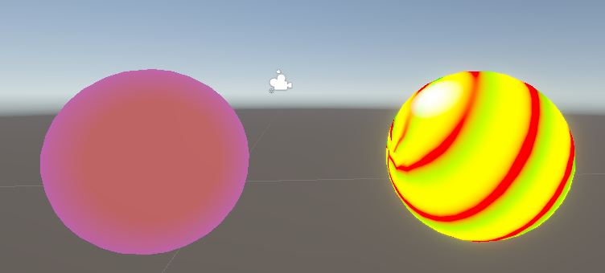

# はじめに
プログラムワークショップⅣの4つ目の管理用です

# 結果画像

- 工夫した点：Twirlノードを用いて綺麗な円のような渦巻ではない特殊な波の形状を作り色を海外のお菓子の飴に近くなるようにした
　　　　　　　フレネルでぼかしspheremaskで覆うようにしました

# 進め方

- 本リポジトリ(tpu-game-2025/PGWS4_4)をforkしてください。
- fork先のリポジトリを更新してください
- Unityのプロジェクトをsrc内で進めて下さい。
- 結果を画面キャプチャして、画像としてリポジトリに追加して、上記のリンクから見れるようにしてください。
- 完成したら本リポジトリのmainブランチにpull requestを投げてください

